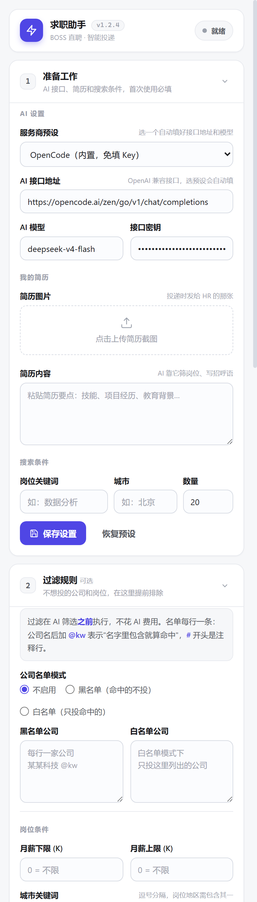
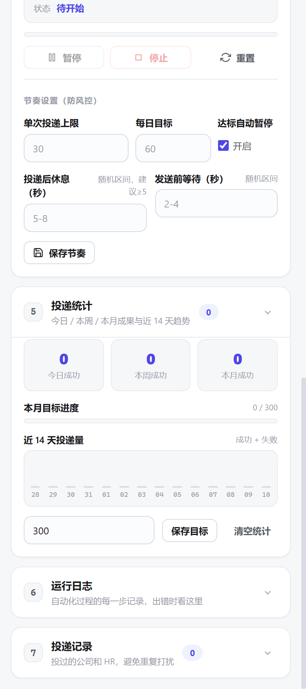

<div align="center">

# 🤖 小北智能招聘 · JobCopilot

**基于 LLM 的 BOSS 直聘智能求职助手：AI 岗位匹配 + 千岗千面招呼语 + 规则预筛 + 自动投递**

让求职不再重复劳动 —— AI 帮你筛岗位、写招呼语，你只管审核，剩下的交给它。


[功能特性](#-功能特性) · [效果预览](#-效果预览) · [快速开始](#-快速开始) · [工作流程](#-工作流程) · [免责声明](#️-免责声明)

</div>

---

## 📖 简介

在 BOSS 直聘海投时，你是否厌倦了：一个个点岗位、复制粘贴千篇一律的招呼语、投到一堆根本不匹配的岗位？

**小北智能招聘（JobCopilot）** 把这套重复劳动自动化：

> 设定关键词 → 自动收集岗位 → **免费规则先剔除一批** → **AI 按你的简历智能筛选** → 你勾选确认 → 自动**逐个**建立联系、发送简历图片和**为每个岗位量身定制的招呼语**。

每条招呼语都结合该岗位的 JD 与你的简历现场生成，开头精准命中岗位核心技能（如「熟悉 Python、数据分析，做过……」），让 HR 一眼看到匹配点。全程有人工审核关，绝不盲投。

## ✨ 功能特性

- 🔍 **自动搜索收集**：按关键词、城市自动抓取岗位，数量自定义
- 🧹 **规则筛选（免费）**：公司黑/白名单、薪资范围、城市/地址、HR 活跃度、邀请量、关键词、注册资金、高德通勤距离——AI 之前零成本剔除
- 🤖 **AI 智能筛选**：结合你的简历自动剔除不匹配/超纲岗位，只投够得着的
- 🔌 **多模型 AI 接口**：内置 OpenCode（免填 Key）、DeepSeek V4、智谱 GLM 预设，也支持任意 OpenAI 兼容端点
- ✍️ **千岗千面招呼语**：每个岗位结合完整 JD 单独生成「熟悉 XXX、做过 XXX」格式，精准对口
- 🛟 **招呼语模板兜底**：自定义模板变量（{{岗位}} {{公司}} {{薪资}} {{地区}} {{HR}} {{技能}} {{关键词}}），AI 挂了也能发
- ✅ **审核确认机制**：投递前列出匹配岗位（含筛选理由、规则剔除项置灰），你勾选确认，绝不盲投
- 📎 **自动发送简历**：先发简历图片，再发招呼语，一个岗位完整闭环再投下一个
- ⏸ **平台额度识别**：触发 BOSS 当日沟通名额弹窗时自动收工，不再无效重试
- 🔒 **风控值守**：命中安全验证页/验证码自动暂停等人工处理；连续失败自动熔断，账号更稳
- 📊 **成果统计**：今日/本周/本月成功数、月度目标进度、近 14 天投递量、各规则拦截计数
- 🛡️ **安全节奏**：默认投递后休息 45-120 秒、单次上限 8、每日 25；支持工作时段限制、每 N 个长休息、验证通过后冷却；已投去重不重复打扰

## 📸 效果预览

> 主面板：投递控制 + AI 接口 + 简历 + 搜索条件



> 成果统计：今日 / 本周 / 本月、月度目标、近 14 天投递量、规则拦截



```
配置岗位/城市/数量  →  免费规则预筛  →  AI 收集筛选  →  审核勾选  →  自动投递  →  ✓ 完成
```

## 🚀 快速开始

### 1. 下载
```bash
git clone https://github.com/sleephard1231/JobCopilot.git
```
或直接 `Code → Download ZIP` 解压。

### 2. 加载扩展（Edge / Chrome 通用）
1. 打开 `edge://extensions`（Chrome 为 `chrome://extensions`）
2. 打开右上角 **开发者模式**
3. 点 **加载解压缩的扩展**，选择本 `JobCopilot · AI/` 文件夹
4. 点击扩展图标，打开侧边栏

### 3. 配置
| 配置项 | 说明 |
|--------|------|
| AI 服务商预设 | 选一个自动填好接口地址与模型；默认 OpenCode 内置免填 Key |
| AI 接口地址 / 模型 / 密钥 | 任意 OpenAI 兼容端点，[DeepSeek 官网申请](https://platform.deepseek.com/)、[智谱开放平台](https://open.bigmodel.cn/) 均可 |
| 简历图片 | 投递时发给 HR 的简历截图（可选） |
| 简历内容 | 用于 AI 筛选与生成招呼语（必填） |
| 招呼语模板 | 可选的兜底模板，AI 不可用时按此发送 |
| 关键词 / 城市 / 数量 | 岗位搜索条件 |

### 4. 使用
**开始收集并筛选** → 在 **审核确认** 区勾选要投的岗位 → **投递选中** → 看着日志自动跑完。

## 🔄 工作流程

```
┌─────────┐   ┌──────────┐   ┌──────────┐   ┌────────────┐   ┌──────────────────────┐
│ 配置条件 │ → │ 收集岗位  │ → │ 规则预筛  │ → │  AI 筛选    │ → │ 人工审核勾选          │
└─────────┘   └──────────┘   └──────────┘   └────────────┘   └──────────────────────┘
                                                                         │
                                                                         ▼
                          对每个选中岗位逐个闭环（含风控值守与拟人节奏）：
                          立即沟通 → 进入聊天 → 发简历图片 → 发定制招呼语 → 下一个
```

## 🛠️ 技术栈

- **浏览器扩展**：Manifest V3，原生 JavaScript（ES2020，无框架、无打包器）
- **AI 模型**：任意 OpenAI 兼容协议（DeepSeek / 智谱 GLM / OpenCode / 自部署…）
- **地理服务**：高德 Web 服务 API（地理编码 + 驾车/步行距离）
- **架构**：Service Worker 编排 + Content Scripts 操作页面 + 侧边栏 UI（`chrome.storage.local` 持久化）

## 📁 项目结构

```
manifest.json            # MV3 清单（权限 / 内容脚本 / 侧边栏）
src/
├── background.js        # 核心编排：收集→规则预筛→AI 筛选→审核→投递 + LLM 调用
├── filters.js           # 岗位过滤引擎（纯函数，可单测）
├── amap.js              # 高德通勤计算（地理编码 + 驾车/步行）
├── selectors.js         # DOM 选择器与城市编码
├── providers.js         # 服务商端点定义
├── content-search.js    # 搜索页：抓取岗位 + 建立联系
├── content-chat.js      # 聊天页：发送简历图片 + 招呼语
└── sidepanel.*          # 侧边栏界面（配置 / 审核 / 统计 / 日志）
tests/                   # Node 层自动化测试 + Edge 冒烟测试
docs/                    # 设计与开发文档、流程图、界面截图
```

## 🧪 测试

```bash
node tests/run-all.js          # 全部 Node 层测试（当前 131 个用例全部通过，约 10s）
node tests/run-all.js 过滤引擎  # 只跑某个套件（子串匹配）
node tests/smoke-edge.js       # 真实 Edge 冒烟测试（headless，独立临时配置）
```

## ⚠️ 免责声明

- 本项目仅供 **学习交流与个人效率提升** 使用，请勿用于商业用途或恶意刷量。
- 自动化操作可能违反 BOSS 直聘的用户协议，使用风险由使用者自行承担。
- 请合理设置投递数量与频率，尊重 HR、珍惜每一次沟通机会。
- 作者不对使用本工具产生的任何后果负责。

## 🤝 贡献

欢迎 Issue 和 PR！如果这个项目帮到了你，点个 ⭐ Star 是对我最大的鼓励。

## 📄 License

[MIT](./LICENSE) © 2026
