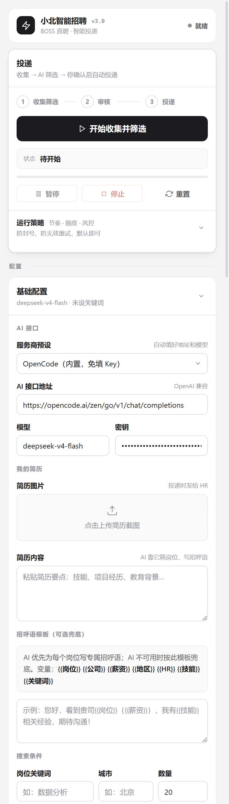
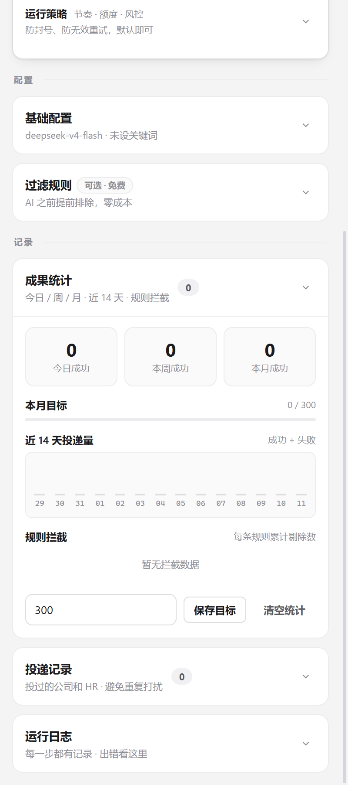

<div align="center">

# 小北智能招聘 · JobCopilot

**BOSS 直聘 AI 求职助手 —— 帮你筛岗位、写招呼语，你只管审核，其余它自动完成。**

[功能](#-它能帮你做什么) · [使用教程](#-使用教程) · [界面预览](#-界面预览) · [常见问题](#-常见问题) · [免责声明](#-免责声明)

</div>

---

## 📌 这是一个什么项目

小北智能招聘是一个浏览器扩展（Edge / Chrome）。它把 BOSS 直聘上"一个个点岗位、复制粘贴一样的招呼语"这套重复劳动交给 AI：

> 你设定关键词 → 它自动收集岗位 → 先用规则免费筛掉一批 → 再让 AI 结合你的简历筛出值得投的 → 你勾选确认 → 它自动逐个打招呼、发简历、发**为每个岗位单独写的**招呼语。

每条招呼语都结合该岗位的 JD 和你的简历现场生成，开头精准命中岗位核心技能，让 HR 一眼看到匹配点。**全程由你审核，不会盲投。**

## ✨ 它能帮你做什么

- **自动收集岗位**：按关键词、城市自动抓取，数量自定义。
- **两层筛选 + AI 打分**：先用免费规则剔除（公司黑白名单、薪资、城市、活跃度、注册资金、通勤距离、硬排除词），再让 AI 结合简历与岗位的地区/经验/学历筛出值得投的，并按**契合度从高到低排序**、标注不符点；AI 严格度可切「宽松 / 适中 / 严格」。
- **千岗千面招呼语**：每个岗位结合完整 JD 单独生成，不再是群发模板。
- **AI 挂了也能投**：可自定义兜底模板，含 `{{岗位}} {{公司}} {{薪资}}` 等变量。
- **自动发简历**：先发简历图片，再发招呼语，一个岗位完整走完再下一个。
- **防封号节奏**：投递间隔、单次上限、每日上限、工作时段、长休息都可调；等待分段显示倒计时，遇验证码自动暂停等你处理，连续失败自动收手，后台服务被回收时也能自动续投剩余岗位。
- **成果统计**：今日 / 本周 / 本月投递数、月度目标、近 14 天趋势、各规则拦截了多少一目了然。

## 🚀 使用教程

### 第一步：把扩展装进浏览器

1. 下载本项目（`Code → Download ZIP` 解压，或 `git clone`）。
2. 打开浏览器扩展页：Edge 是 `edge://extensions`，Chrome 是 `chrome://extensions`。
3. 打开右上角 **开发者模式**。
4. 点 **加载解压缩的扩展**，选择项目里的 **`JobCopilot · AI`** 文件夹。
5. 点浏览器工具栏的扩展图标，右侧会弹出操作面板。

### 第二步：配置 AI 接口

1. 在面板里展开 **「基础配置」**。
2. **服务商预设**（推荐）：默认选中 **OpenCode（内置，免填 Key）**，直接就能用。
   - 想用自己的账号，可选 **DeepSeek** 或 **智谱 GLM**，然后在「密钥」里粘贴你申请的 API Key（[DeepSeek 申请](https://platform.deepseek.com/)、[智谱申请](https://open.bigmodel.cn/)）。
   - 也可以填任意 **OpenAI 兼容** 的接口地址和模型。
3. 选好后点 **保存设置**。

### 第三步：填写你的简历

同样在「基础配置」里：

- **简历图片**：上传一张简历截图（投递时会发给 HR，也可暂不上传，只发招呼语）。
- **简历内容**：把简历文字粘贴进去（必填）。AI 靠它筛岗位、写招呼语，填得越详细越准。
- **招呼语模板**（可选）：不想用 AI 写的招呼语时可以填一个兜底模板，支持 `{{岗位}} {{公司}} {{薪资}} {{地区}} {{HR}} {{技能}} {{关键词}}` 变量。

### 第四步：设置搜索条件

在「基础配置」最下方填写：

- **岗位关键词**：如「数据分析」「前端」。
- **城市**：如「北京」（支持常见城市，填「全国」也行）。
- **数量**：这一轮想收集多少个岗位，默认 20。

> 可选：展开 **「过滤规则」**，设置公司黑/白名单、薪资范围、城市、活跃度、注册资金、通勤距离等，让免费规则先帮你排掉不想看的岗位。展开 **「运行策略」** 可以调整投递节奏、单次/每日上限、工作时段和风控。

### 第五步：开始收集并筛选

点面板顶部的 **「开始收集并筛选」** 按钮。扩展会：

1. 自动打开 BOSS 搜索页并收集岗位；
2. 用规则免费过滤；
3. 逐个让 AI 判断是否值得投。

过程中「运行日志」会实时显示进度，随时可以 **暂停 / 停止 / 重置**。

### 第六步：审核并投递

1. 筛选完成后，面板会列出**匹配的岗位和理由**，规则剔除的岗位置灰。
2. 勾选你真正想投的岗位（可全选），点 **「投递选中」**。
3. 扩展就会逐个岗位：建立联系 → 进入聊天 → 发简历图片 → 发专属招呼语 → 下一个。你只需看着日志跑完。

### 第七步：看结果

- **成果统计**：查看今日 / 本周 / 本月成功数、月度目标进度、近 14 天趋势。
- **投递记录**：记录投过的公司和 HR，自动去重、不重复打扰，支持导出 / 导入。

## 🖼 界面预览

<div align="center">
  <a href="docs/ui-preview.png"></a>
  &nbsp;&nbsp;
  <a href="docs/ui-stats-preview.png"></a>
  <br>
  <sub>左：主面板　右：成果统计（点击可看大图）</sub>
</div>

## ❓ 常见问题

| 问题 | 解决办法 |
|------|----------|
| 提示 API 鉴权失败（401/403） | 接口地址或 Key 不对，检查后重填，或点「恢复预设」用内置预设 |
| 运行日志提示"请先填写简历" | 到「基础配置 → 我的简历 → 简历内容」粘贴简历文字 |
| 自定义接口连不上 | 回到面板点「保存设置」，按提示授权该接口域名 |
| 弹出滑块/验证码后不动了 | 这是风控保护，手动在标签页完成验证，再回面板点「继续」 |
| 一个岗位都没投出去 | 检查关键词是否太窄、过滤规则是否过严，或看日志里的失败原因 |
| 只发了招呼语没发简历 | 未上传简历图片，去「我的简历」上传即可 |

## ⚠️ 免责声明

- 本项目仅供**学习交流与个人效率提升**使用，请勿用于商业用途或恶意刷量。
- 自动化操作可能违反 BOSS 直聘的用户协议，使用风险由使用者自行承担。
- 请合理设置投递数量与频率，尊重 HR、珍惜每一次沟通机会。
- 作者不对使用本工具产生的任何后果负责。

## 🧑💻 给开发者

扩展位于 `JobCopilot · AI/`，纯原生 JS（Manifest V3，无框架、无打包）。代码结构、实现细节与测试说明见 [`JobCopilot · AI/docs/DEVELOPMENT.md`](JobCopilot%20%C2%B7%20AI/docs/DEVELOPMENT.md)。运行测试：

```bash
cd "JobCopilot · AI"
node tests/run-all.js
```

## 📄 License

[MIT](./LICENSE) © 2026
